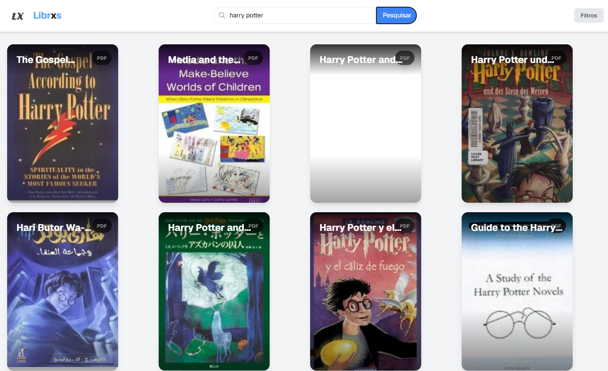
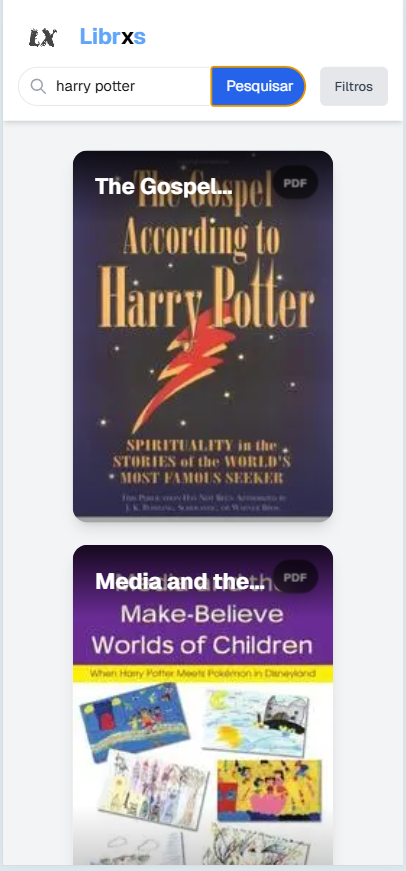

# Librxs

Download de livros gratuitos


   
    
## Como Rodar o Projeto (libgen-api-service)

Este projeto usa um ambiente virtual Python para gerenciar dependências.

### Pré-requisitos

*   Python 3.7 ou superior instalado.
*   `pnpm` instalado globalmente (`npm install -g pnpm`).

### Configuração e Execução

1.  **Clone o repositório:**

    ```bash
    git clone https://github.com/Gstxxx/Librxs
    cd Librxs
    ```


2.  **Crie o ambiente virtual (dentro do diretório `packages/libgen-api-service`):**

    ```bash
    cd packages/libgen-api-service
    python3 -m venv .venv  # Use python3 se python não funcionar
    ```

3.  **Ative o ambiente virtual:**

    *   **Linux/macOS:**

        ```bash
        source .venv/bin/activate
        ```

    *   **Windows (PowerShell):**

        ```powershell
        .\.venv\Scripts\Activate.ps1
        ```
    * **Windows (CMD):**
        ```
        .venv\Scripts\activate
        ```

4.  **Instale as dependências do Python:**

    ```bash
    pip install -r requirements.txt
    ```

5.  **Volte para o diretório raiz do projeto:**

    ```bash
    cd ../..
    ```

6.  **Instale as dependências do Node.js (para todo o projeto):**

    ```bash
    pnpm install -r
    ```

7.  **Inicie os serviços:**

    ```bash
    pnpm start
    ```

    Isso iniciará a API (na porta 5000) e o aplicativo Next.js (na porta 3000).

8.  **Acessando**
    Abra [http://localhost:3000](http://localhost:3000) no seu browser


    ### Preview

       

    ### Preview Mobile
    
